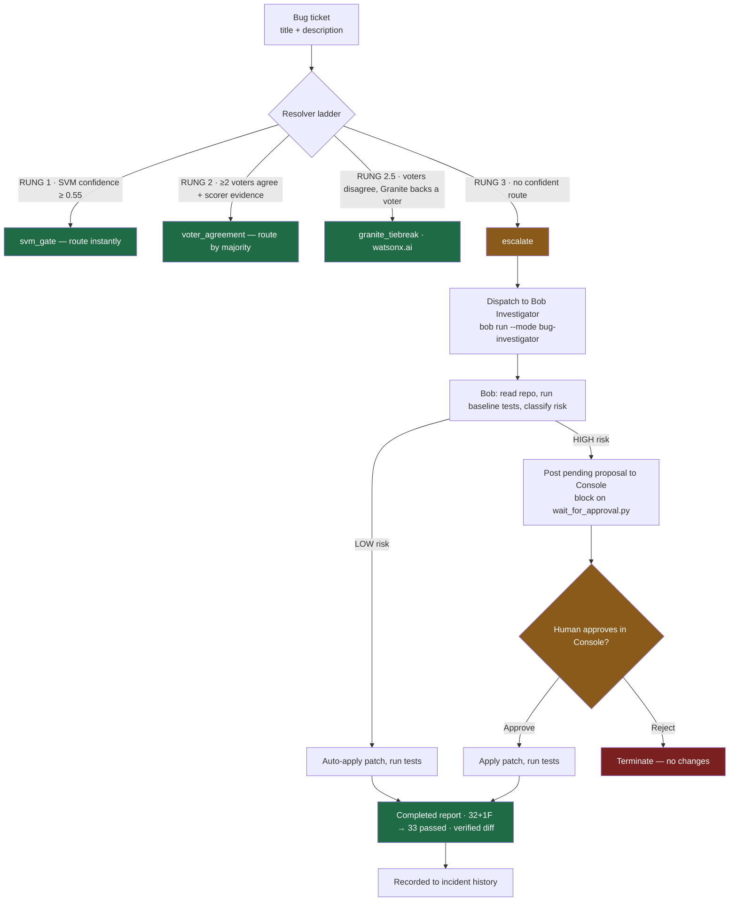

# TriageGate

**An AI-powered ticket-routing ladder that combines statistical classifiers, optional LLM tiebreaking, and risk-gated automated debugging — stopping every fix that touches payment or auth code until a human approves it.**

---

## Architecture



**Three deterministic voters** — `DeterministicScorer` (weighted vocabulary), `SVM` (TF-IDF + LinearSVC), and `kNN` (cosine, k=5, with incident retrieval) — resolve routine tickets. **Granite** (watsonx.ai) is an optional fourth voter consulted only to break ties. Genuinely ambiguous tickets **escalate to IBM Bob 2.0**, which investigates the repository and — for HIGH-risk changes — requires human approval in the Console before applying anything.

Each ticket stops at the earliest rung that can resolve it confidently. The pipeline path is visualised live in the Console tab.

**The core idea:** most tools send every ticket to an expensive agent. TriageGate resolves routine reports cheaply and explainably, then dispatches only the hard cases to an agent — with tests and human control proving the result.

---

## Risk-Gated Autonomy

The Bug Investigator classifies every proposed fix before touching any file:

| Risk level | Trigger | Action |
|------------|---------|--------|
| **HIGH** | Patch touches `app/payments.py`, `app/sessions.py`, or destructive DB ops | Posts a pending proposal (diff + justification) to the TriageGate Console and blocks on `scripts/wait_for_approval.py`; applies only after the operator approves through the Console's approval endpoint |
| **LOW** | All other changes (pure logic, read-only paths) | Applied immediately; `auto_applied: true` in report |

HIGH-risk patches are **never applied automatically**. The investigator posts its proposed fix to the Console and waits on the approval endpoint; it applies the patch only after a human clicks **Approve** in the TriageGate Console. Approval happens in one place — the Console — not in the Bob session.

---

## Quickstart

```bash
# Install dependencies
pip install -r requirements.txt

# Train the SVM and KNN classifiers
python scripts/train.py

# If scikit-learn version changes, re-run scripts/train.py to regenerate the saved model.

# Start the server
uvicorn triagegate.web.server:app --app-dir src
```

Open [http://localhost:8000](http://localhost:8000) to access the Console.

Optional: set WatsonX credentials in a `.env` file to enable the Granite tiebreak node:

```
WATSONX_API_KEY=...
WATSONX_PROJECT_ID=...
WATSONX_URL=...
```

Without these, the server runs fully offline; the Granite node renders as never-reached in the pipeline view and the header badge reads "POWERED BY IBM BOB 2.0".

---

## Tests

```bash
# Full suite (runs from repo root)
python -m pytest

# Demo-repo suite only (used by the Bug Investigator)
cd demo_repo && python -m pytest
```

The full suite is **367 tests**, all passing. The demo-repo suite includes one expected-fail test (`test_idempotency.py`) which documents the seeded bug the Bug Investigator is designed to find and fix.

---

## Data Provenance

The training corpus is **synthetic**: tickets were generated from domain-labelled templates covering five domains: `api`, `database`, `frontend`, `auth`, and `build`. The adversarial set (`data/ambiguous_tickets.csv`) consists of seven tickets written by hand to probe edge cases — ambiguous phrasing, mixed-domain signals, and deliberately misleading keywords.

No real customer data was used at any stage.

---

## Results Summary

| Metric | Value | Notes |
|--------|-------|-------|
| SVM gate resolution | **84%** | Tickets resolved at first rung (confidence ≥ 0.55) |
| Voter agreement resolution | **16%** | Resolved at second rung after gate pass-through |
| Synthetic in-distribution eval | **100%** (50/50) | Held-out synthetic tickets, all correctly routed |
| Adversarial escalations | **2 / 7** | 2 of 7 hand-written adversarial tickets reached escalation |
| Known confident misroute | **A-0004** | One ticket is routed with high confidence to the wrong domain; documented as a known limitation |

These numbers reflect a 50-ticket synthetic evaluation and a 7-ticket adversarial set. They are not representative of production traffic distributions.
